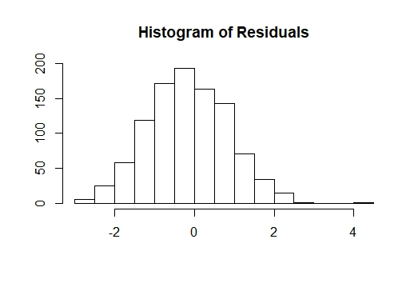
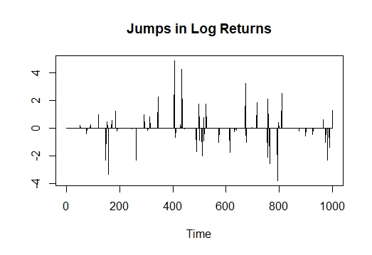
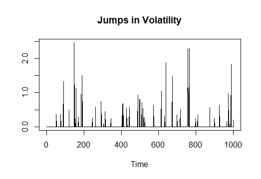
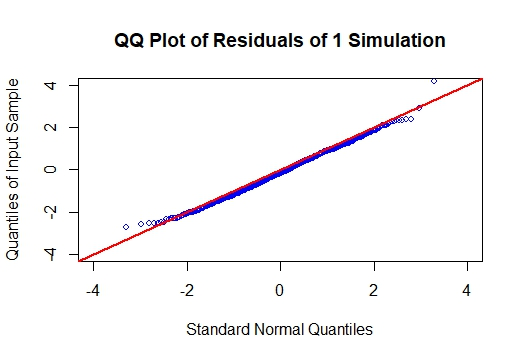
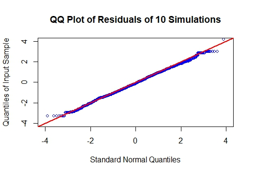
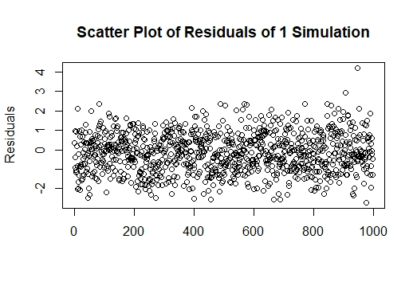
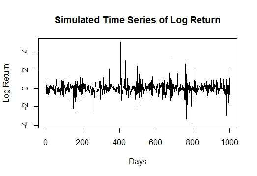
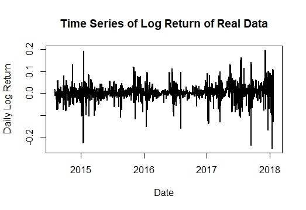
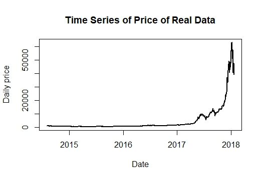

[](http://quantlet.de/)

## [](http://quantlet.de/) **SFECrixSimu** [](http://quantlet.de/)

```yaml

Name of Quantlet:  SFECrixSimu
 
Published in:      Statistics of Financial Markets I
  
Description:       Simulates Crix log return by using a model of Stochastic Volatility with Correlated Jumps (SVCJ).
 
Keywords:          Crix, SVCJ, Log Return, Cryptocurrency, Jumps, Volatility

Author:            Ivan Perez and Ariel Naamat
  
Submitted:         Wed, 24th of January 2018
  
Datafile:          http://crix.hu-berlin.de/data/crix.json
  
Input:  	   Parameters according to MCMC (Markov Chain Monte Carlo)
  
Output:            Simulated SVCJ for Log Return of Crix  
```

.jpeg")

.jpeg)



















### R Code
```r

'''
This code is based on: Chen YHC, Härdle WK, Hou AJ, Wang W (2018)
Pricing Cryptocurrency options: 
the case of CRIX and Bitcoin. J Financial Econometrics, submitted
(ISSN: 2568-5619) 20018-004 


The parameters are according to MCMC which is explained in this paper.
In this quantlet there is an additional code in Matlab for the MCMC (SVCJ_crix.m)
'''

# Clear variables, close windows, set seed and load packages
rm(list = ls(all = TRUE))
graphics.off()
set.seed(91)
if (!require("jsonlite")) install.packages("jsonlite")
library("jsonlite")
if (!require("ggplot2")) install.packages("ggplot2")
library("ggplot2")

# Get updated Crix data from: http://crix.hu-berlin.de/
crix = fromJSON("http://crix.hu-berlin.de/data/crix.json", flatten = TRUE)

# Save date variable as date
crix[, "date"] = as.Date(crix[["date"]])

# Calculate log return for each date
crix[, "log_return"] = numeric()
for (i in 2:nrow(crix)) {
    crix$log_return[i] = log(crix[i, 2]) - log(crix[i - 1, 2])
}

# Plot a time series of Crix price and log return of Crix
plot(crix$date, crix$price, type = "l", col = "black", lwd = 2, xlab = "Date", ylab = "Daily price")
plot(crix$date, crix$log_return, type = "l", col = "black", lwd = 2, xlab = "Date", ylab = "Daily Log Return")

# Parameters from MCMC for Crix log return simulation
n      = 1000  # Number of observaions in each simulation (will use n-1 since Y1 = 0)
kappa  = 0.187  # Speed of volatility mean reversio
theta  = 0.054  # Part of the long term mean of volatility
beta   = 0.0069  # Diffusion parameter of volatility (sig_v)
rho    = 0.2748  # Brownin motion correlation
mJ     = -0.049  # Mean of price jump size
s2J    = 2.06  # Variance of price jump size
lambda = 0.051  # Intensitiy of the pure jump process
mV     = 0.709  # Mean of volatility jump size
rhoJ   = -0.21  # Jumps correlation
mu     = 0.0421  # Drift parameter of Returns

# Create empty vectors to store the simulated values
V    = numeric(n)  # Volatility of log return
Y    = numeric(n)  # Log return
E    = numeric(n - 1)  # Residuals of standarized log return
Jv   = numeric(n)  # Jumps in volatility
Jy   = numeric(n)  # Jumps in log return
V[1] = mV  # Initial value of volatility = mean of volatilty

# Run the simulation 999 times and save the calculated values
for (i in 2:n) {
    Z        = rnorm(n = 1, mean = 0, sd = 1)  # Standard normal random value
    Z2       = rnorm(n = 1, mean = 0, sd = 1)  # Standard normal random value
    J        = rpois(lambda = lambda, n = 1)  # Poisson distributed random value with lambda = 0.051 for determining whether a jump exists
    XV       = rexp(n = 1, rate = 1/mV)  # Exponential distributed random value with mV = 0.709 for jump size in volatility
    X        = rnorm(n = 1, mean = mJ + rhoJ * XV, sd = s2J)  # Jump size of log return
    V[i]     = kappa * theta + (1 - kappa) * V[i - 1] + beta * sqrt(V[i - 1]) * Z2 + XV * J  # Volatilty
    Y[i]     = sqrt(V[i - 1]) * Z2 + X * J  # Log return
    Z[i]     = X
    E[i - 1] = (Y[i] - mu - Z[i] * J)/sqrt(V[i - 1])  # Residuals
    Jv[i]    = XV * J  # Jumps in volatilty (0 in case of no jump)
    Jy[i]    = X * J  # Jumps in log return (0 in case of no jump)
}

summary(Y)

# Plotting jumps for log return and volatilty
plot(Jv, type = "l", xlab = "Time", ylab = "", main = "Jumps in Volatility")
plot(Jy, type = "l", xlab = "Time", ylab = "", main = "Jumps in Returns")

# Plotting simulated time series of log return
Y_dates = seq(1:n)
Y_mat   = as.data.frame(cbind(Y, Y_dates))
plot(Y_mat$Y_dates, Y_mat$Y, type = "l", col = "black", xlab = "Days", ylab = "Log Return")

# Plotting scatter plot and histogram of residuals
plot(E, ylab = "Residuals", xlab = "", main = "Residuals according to (14) of 1 Simulation")
hist(E, main = "Histogram of Residuals", ylab = "", xlab = "")

# Calculating residuals for more 9 simulations (total 8991 + 999 = 9990 points)
E_all        = numeric((n - 1) * 10)
E_all[1:999] = E  # Save it the residuals vector of the first simulation in the residuals matrix

for (j in 2:10) {
    set.seed(90 + i)
    for (i in 2:n) {
        Z     = rnorm(n = 1, mean = 0, sd = 1)
        Z2    = rnorm(n = 1, mean = 0, sd = 1)
        J     = rpois(lambda = lambda, n = 1)
        XV    = rexp(n = 1, rate = 1/mV)
        X     = rnorm(n = 1, mean = mJ + rhoJ * XV, sd = s2J)
        V[i]  = kappa * theta + (1 - kappa) * V[i - 1] + beta * sqrt(V[i - 1]) * Z2 + XV * J
        Y[i]  = sqrt(V[i - 1]) * Z2 + X * J
        Z[i]  = X
        E_all[(i - 1) + (j - 1) * 999] = (Y[i] - mu - Z[i] * J)/sqrt(V[i - 1])
        Jv[i] = XV * J
        Jy[i] = X * J
    }
}

# Plotting QQ Plot and Contour plot of residuals of 1 simulation
qqnorm(y = E, xlim = c(-4, 4), ylim = c(-4, 4), col = "blue", cex = 0.8, main = "QQ Plot of Residuals of 1 Simulation", 
    ylab = "Quantiles of Input Sample", xlab = "Standard Normal Quantiles")
abline(a = 0, b = 1, col = "red", lwd = 2)

Mat = as.data.frame(cbind(sort(E), sort(rnorm(n = n - 1))))
ggplot(data = Mat, aes(x = V1, y = V2)) + geom_density_2d(aes(colour = ..level..)) + xlab("Residuals") + 
    ylab("Standard Normal Vector") + ggtitle("Contour QQ Plot (1 Simulation)") + theme_bw()

# Plotting QQ Plot and Contour plot of residuals of 1 simulation
qqnorm(y = E_all, xlim = c(-4, 4), ylim = c(-4, 4), col = "blue", cex = 0.8, main = "QQ Plot of Residuals of 10 Simulations", 
    ylab = "Quantiles of Input Sample", xlab = "Standard Normal Quantiles")
abline(a = 0, b = 1, col = "red", lwd = 2)

Mat_all = as.data.frame(cbind(sort(E_all), sort(rnorm(9990))))
ggplot(data = Mat, aes(x = V2, y = V2)) + geom_density_2d(aes(colour = ..level..)) + xlab("Residuals") + 
    ylab("Standard Normal Vector") + ggtitle("Contour QQ Plot (10 Simulations)") + theme_bw()
```

automatically created on 2018-05-28
