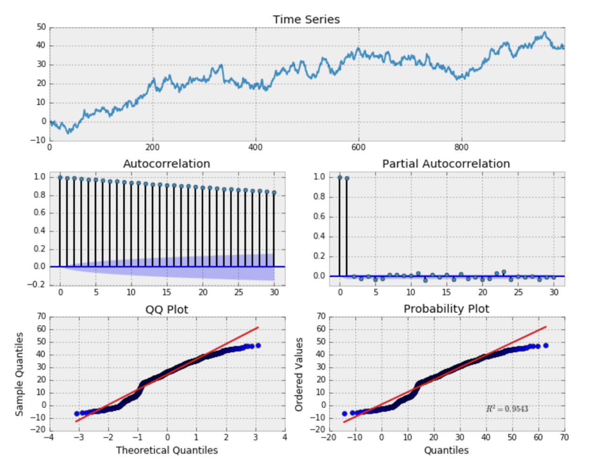

[](http://quantlet.de/)

## [](http://quantlet.de/) **SFERWSimu** [](http://quantlet.de/)

```yaml

Name of Quantlet: SFERWSimu

Published in: Statistics of Financial Markets I

Description: Investigates time series of a random walk

Keywords: time series, random walk, RW, TS, first difference, non stationarity, python

Author: Bharathi Srinivasan, David Berscheid 

Submitted:  11th of January 2018

Input:
- x : random sequence
- n_samples: number of observations
- start: start date of time series
- end: end date of time series
- lag: number of lags displayed in the ACF and PACF plot
 
Output:  A plot of the time series, plots of the autocorrelation function and the partial autocorrelation function, QQ plot, probability plot

```




### PYTHON Code
```python

def random_walk():

    import os
    import sys

    import pandas as pd
    import pandas_datareader.data as web
    import numpy as np

    import statsmodels.formula.api as smf
    import statsmodels.tsa.api as smt
    import statsmodels.api as sm
    import scipy.stats as scs
    from arch import arch_model

    import matplotlib.pyplot as plt
    import matplotlib as mpl
    get_ipython().magic('matplotlib inline')
    p = print

    end = '2017-01-01'
    start = '2008-01-01'
    get_px = lambda x: web.DataReader(x, 'yahoo', start=start, end=end)['Adj Close']

    symbols = ['SPY','TLT','MSFT']
    # raw adjusted close prices
    data = pd.DataFrame({sym:get_px(sym) for sym in symbols})
    # log returns
    lrets = np.log(data/data.shift(1)).dropna()

    def tsplot(y, lags=None, figsize=(10, 8), style='bmh'):
        if not isinstance(y, pd.Series):
            y = pd.Series(y)
        with plt.style.context(style):    
            fig = plt.figure(figsize=figsize)
            #mpl.rcParams['font.family'] = 'Ubuntu Mono'
            layout = (3, 2)
            ts_ax = plt.subplot2grid(layout, (0, 0), colspan=2)
            acf_ax = plt.subplot2grid(layout, (1, 0))
            pacf_ax = plt.subplot2grid(layout, (1, 1))
            qq_ax = plt.subplot2grid(layout, (2, 0))
            pp_ax = plt.subplot2grid(layout, (2, 1))

            y.plot(ax=ts_ax)
            ts_ax.set_title('Time Series Analysis Plots')
            smt.graphics.plot_acf(y, lags=lags, ax=acf_ax, alpha=0.5)
            smt.graphics.plot_pacf(y, lags=lags, ax=pacf_ax, alpha=0.5)
            sm.qqplot(y, line='s', ax=qq_ax)
            qq_ax.set_title('QQ Plot')        
            scs.probplot(y, sparams=(y.mean(), y.std()), plot=pp_ax)

            plt.tight_layout()
        return


    # Random Walk without a drift
    print("Random Walk without a drift")
    np.random.seed(1)
    n_samples = 1000

    x = w = np.random.normal(size=n_samples)
    for t in range(n_samples):
        x[t] = x[t-1] + w[t]

    _ = tsplot(x, lags=30)
     
    # First difference of simulated Random Walk series
    print("First difference of a simulated RW series")
    _ = tsplot(np.diff(x), lags=30)

    # First difference of SPY prices
    print("First difference of SPY prices")
    _ = tsplot(np.diff(data.SPY), lags=30)
```

automatically created on 2018-05-28