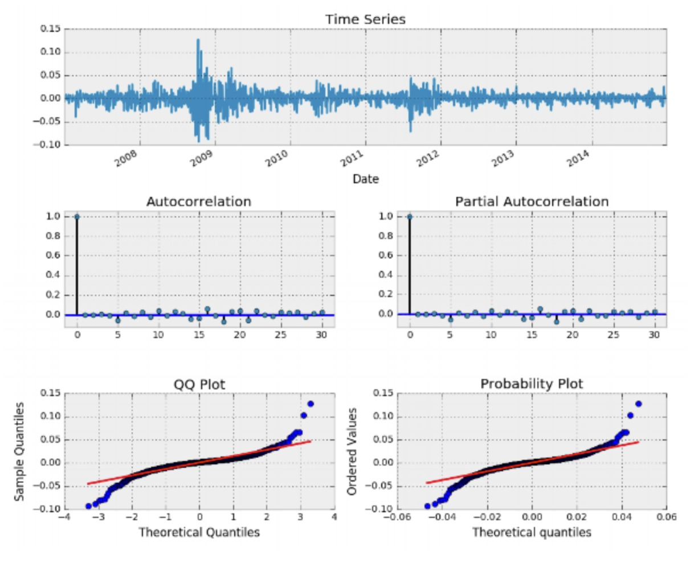

[](http://quantlet.de/)

## [](http://quantlet.de/) **RealDataExMA** [](http://quantlet.de/)

```yaml

Name of Quantlet: RealDataExMA

Published in: Statistics of Financial Markets I

Description: Investigates time series of real financial data and finds appropriate moving average model   

Keywords: time series, MA, moving average, real data, financial data, python

Author: Bharathi Srinivasan, David Berscheid 

Submitted:  11th of January 2018

Input :
- y : time series
- start: start date of time series
- end: end date of time series
- max_lag: maximum number of lags considered for the MA model
 
Output:  A plot of the time series, plots of the autocorrelation function and the partial autocorrelation function, QQ plot, probability plot

```

