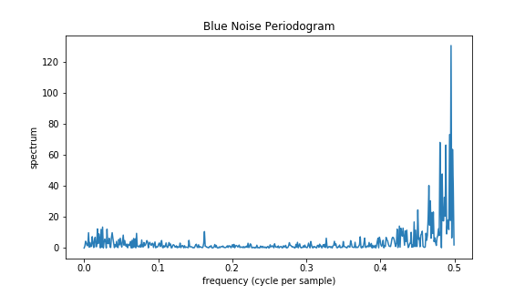
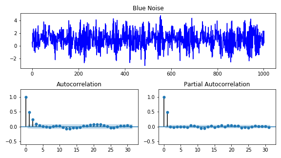
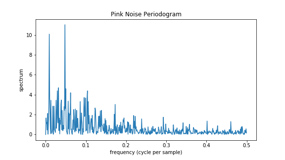
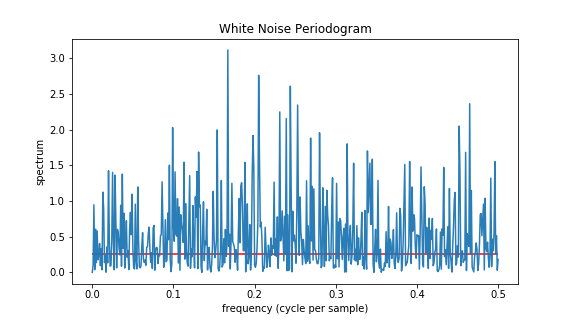

[](http://quantlet.de/)

## [](http://quantlet.de/) **Intro** [](http://quantlet.de/)

```yaml

Name of QuantLet: Intro

Published in: Statistics of Financial Markets 1

Description: Draws figures for White, Pink and Blue noise in time-domain and frequency-domain, ACF, PCF and applied Fourier transform

Keywords: White nose, pink noise, blue noise, time-domain, frequency-domain, Fourier transform

Author: Francis Liu

Submitted: Tuesday, May 24 2022 by Junjie Hu

Input: blue_noise, pink_noise, white_noise

Output: ACF_BN, ACF_PN, ACF_WN, FD_BN, FD_HBO, FD_PN, FD_SinFunc, FD_WN, HBO_TD, TD_BN, TD_Decomp, TD_PN, TD_WN

```












### [IPYNB Code: Intro.ipynb](Intro.ipynb)


automatically created on 2022-05-26