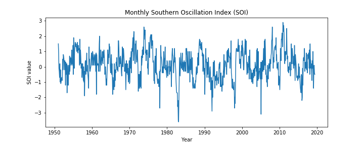
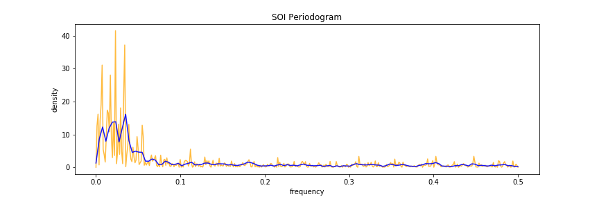
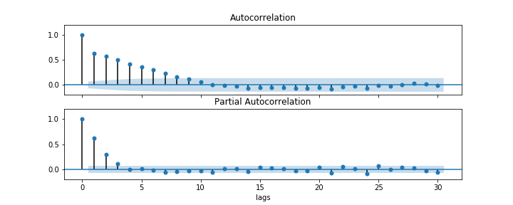

[](http://quantlet.de/)

## [](http://quantlet.de/) **SOI** [](http://quantlet.de/)

```yaml

Name of QuantLet: SOI

Published in: Statistics of Financial Markets 1

Description: Visualise the SOI index and its periodogram

Keywords: Periodogram, Spectrogram, Spectral Analysis, Fourier transform

Author: Francis Liu

Submitted: Tuesday, Jul 10 2022 by Francis Liu

```







### [IPYNB Code: SOI.ipynb](SOI.ipynb)


automatically created on 2022-07-31