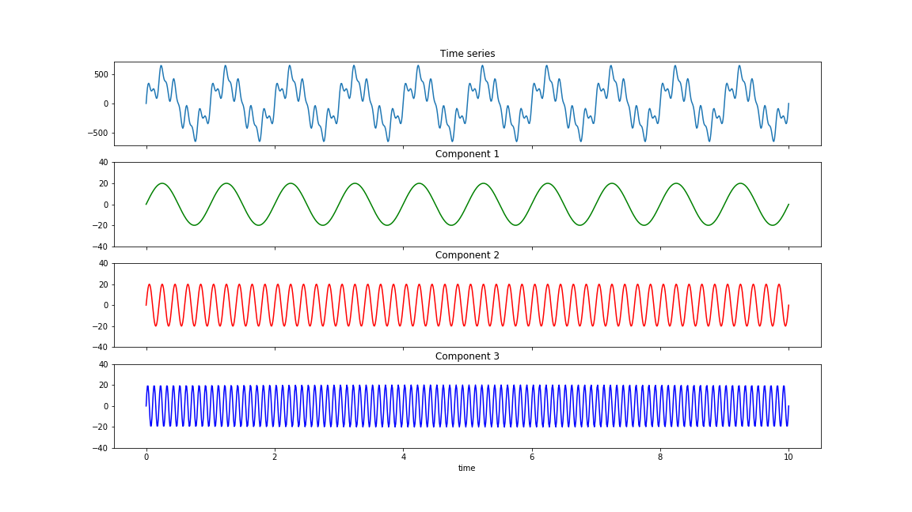
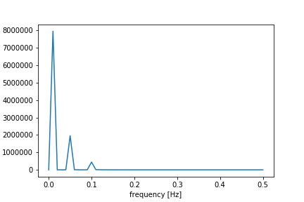
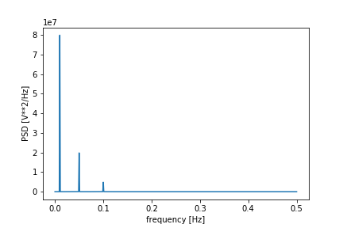
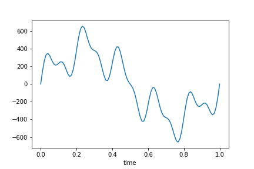
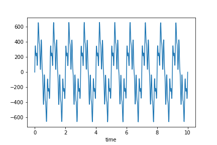

[](http://quantlet.de/)

## [](http://quantlet.de/) **decomposition** [](http://quantlet.de/)

```yaml

Name of QuantLet: decomposition

Published in: Statistics of Financial Markets 1

Description: Make example of simple decomposition

Keywords: White nose, pink noise, blue noise, time-domain, frequency-domain, Fourier transform

Author: Francis Liu

Submitted: Tuesday, 11 July 2022 by Junjie Hu
```











### [IPYNB Code: decomposition.ipynb](decomposition.ipynb)


automatically created on 2022-07-31