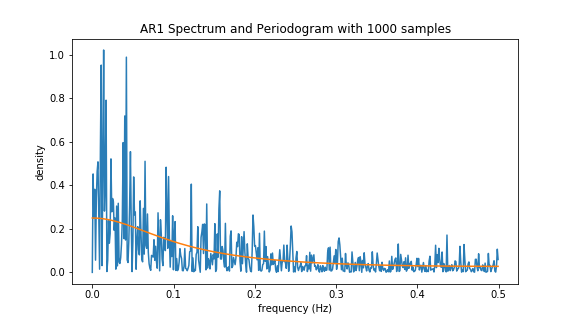
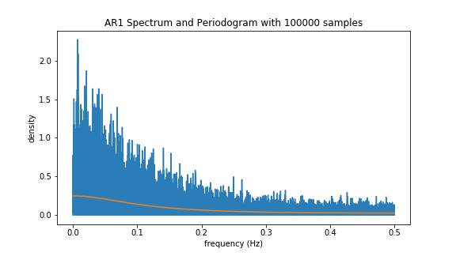

[](http://quantlet.de/)

## [](http://quantlet.de/) **periodogramVSspectrum** [](http://quantlet.de/)

```yaml

Name of QuantLet: periodogramVSspectrum

Published in: Statistics of Financial Markets 1

Description: Compare periodogram and spectrum

Keywords: Periodogram, Spectrum, Spectral Analysis, Fourier transform

Author: Francis Liu

Submitted: Tuesday, Jul 10 2022 by Francis Liu

```





### [IPYNB Code: periodogramVSspectrum.ipynb](periodogramVSspectrum.ipynb)


automatically created on 2022-07-31